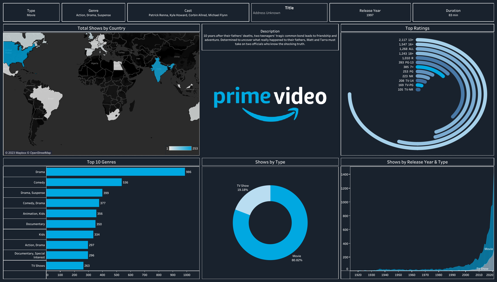

# Amazon Prime Titles Analysis Dashboard

## Overview
This project involves a comprehensive data visualization and analysis of Amazon Prime video titles. The dashboard provides insights into the variety of content available on the platform, including movies and TV shows, their genres, release years, ratings, and geographical distribution.

## Project Structure
The repository contains the following key files:
- **`Amazon Prime Dashboard.twbx`**: The main Tableau Packaged Workbook containing the interactive dashboard and visualizations.
- **`amazon_prime_titles.csv`**: The dataset used for the analysis, which includes detailed information about movies and TV shows available on Amazon Prime.
- **`Snapshot.png`**: A static snapshot of the completed Tableau dashboard.
- **`Prime video logo.png`**: Logo assets used within the dashboard for branding.
- **`Radial Bar chart values.txt`**: A helper file containing specific values used to create the radial bar chart visualization in Tableau.

## Dataset
The dataset (`amazon_prime_titles.csv`) includes the following key attributes for each title:
- `show_id`: Unique identifier for each show/movie
- `type`: Identifier (Movie or TV Show)
- `title`: Title of the content
- `director`: Director of the movie/show
- `cast`: Main cast members
- `country`: Country of production
- `date_added`: Date the title was added to Amazon Prime
- `release_year`: Original release year
- `rating`: Age rating
- `duration`: Length of the movie or number of seasons for TV shows
- `listed_in`: Genres and categories
- `description`: Brief synopsis

## Technologies Used
- **Tableau**: Used for data preparation, visualization, and building the interactive dashboard.
- **Data Source**: CSV (Comma Separated Values) format for raw data storage.

## How to View the Dashboard
To explore the interactive dashboard:
1. Download and install [Tableau Desktop](https://www.tableau.com/products/desktop) or use the free [Tableau Reader](https://www.tableau.com/products/reader).
2. Open the `Amazon Prime Dashboard.twbx` file.
3. Interact with the various charts and filters to explore the Amazon Prime catalog.
# Amazon-prime-dashboard
